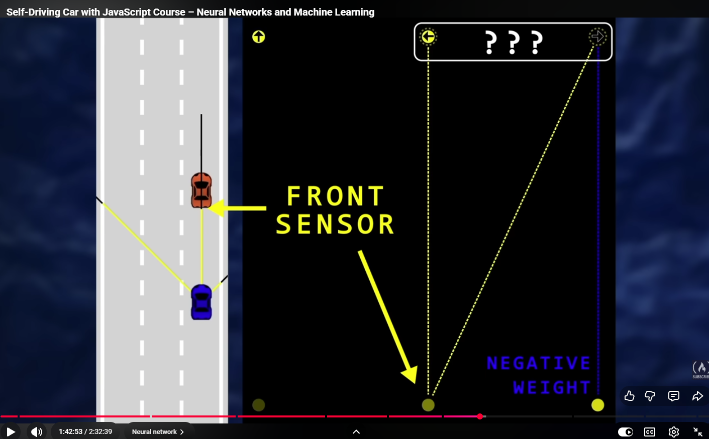
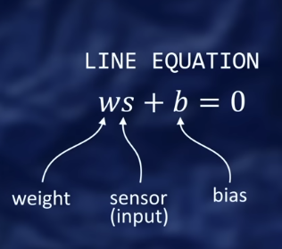
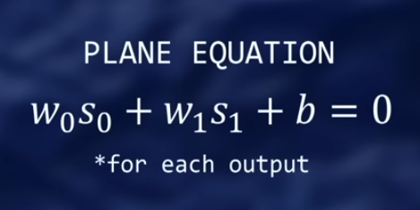
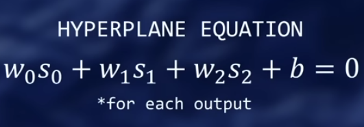

# atan2

https://chatgpt.com/c/6978b6bb-a2bc-838d-b6dd-7dce2a4b8b1e

atan2 normally used as: `Math.atan2(y,x) //(height,width)`

Returns the angle from the positive x axis, counter-clockwise, to the vector (x, y).

However we are doing:

```js
const alpha = Math.atan2(this.width, this.height);
```

- height and width are swapped
- atan2 always produces an anti-clockwise angle

https://chatgpt.com/c/6978c4df-9eb4-8325-98f7-b88d27c02f84


One-sentence takeaway:

Blue says: “Angle 0 means up.”
Orange says: “Angle 0 means right.”
Canvas says: “Also… Y is upside down.” 😄

## getReading, getIntersection, polysIntersect

- getIntersection takes 4 points: A, B, C, D `{x,y}`
  - returns intersection x,y,offset or null if none
  - segments are: A-B, C-D

- polysIntersect
  - takes 2 arrays of points: [{x,y},{x,y},{x,y}],[{x,y},{x,y},{x,y}]
  - uses getIntersection to detect touches
    returns true/false

- getReading
  - takes a ray and an array of segments
  - ray: [{x,y}, {x,y}] - start and end point of ray
  - segments: [[{x,y}, {x,y}], [{x,y}, {x,y}], [{x,y}, {x,y}]] - array containing arrays where each subarray holds 2 points, the start and end of the line segment
  - returns null or the point nearest the car where the ray intersects with another line segment

- We want to update this.readings in sensor when the ray intersects with a line segment of the polygon of another car
  - we could construct an array of segments from `this.polygon`
  - we then pass these segments to getReading

# Level

- represents 1 layer of a simple neural network
- has a layer of input neurons and output neurons
  - number of inputs and number of outputs can differ
- input neurons held in `inputs` array
- output neurons held in `outputs` array
- each output neron has a bias
  - we store the biases in the `biases` array
  - the bias is the value at which the neuron fires
- weights
  - every input neuron is connected to every output neuron
  - each connection has a weight
  - we store the weights in a matrix
    - [[a,b,c], [a,b,c],[a,b,c]]
- weights and biases values
  - For the simple network to function, biases and weights need to be set to some initial values
  - we set the weight values between -1 and 1: ` level.weights[i][j]=Math.random()*2-1;`
  - why use negative values?



- a negative value might indicate "do not turn to the right" in the above image, so the remaining option is turn to the left
- the inputs are values we get from the car sensors
- we compute outputs using weights and biases
  - uses a feedforward algorithm

# Simple model

- we use: ` if (sum > level.biases[i])`
- the code will work but typical models use: ` if (sum + level.biases[i] >0)`
- the line equation in a simple network - one input, one output
  
  - weight controls the slope
  - bias controls the y-intercept
- with 2 sensors you have a plane in 3d space
  
- with 3 sensors you have a hyperplane
  
- our network uses binary values, on or off for hidden layer neurons
  - our input layer does use partial firing
- in a scientific model - hidden layer neurons can partially fire
- the output values are typically binary - for on/off or yes/no answers
