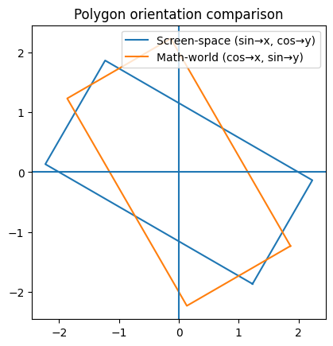

# atan2

https://chatgpt.com/c/6978b6bb-a2bc-838d-b6dd-7dce2a4b8b1e

atan2 normally used as: `Math.atan2(y,x) //(height,width)`

Returns the angle from the positive x axis, counter-clockwise, to the vector (x, y).

However we are doing:

```js
const alpha = Math.atan2(this.width, this.height);
```

- height and width are swapped
- atan2 always produces an anti-clockwise angle

https://chatgpt.com/c/6978c4df-9eb4-8325-98f7-b88d27c02f84


One-sentence takeaway:

Blue says: “Angle 0 means up.”
Orange says: “Angle 0 means right.”
Canvas says: “Also… Y is upside down.” 😄
